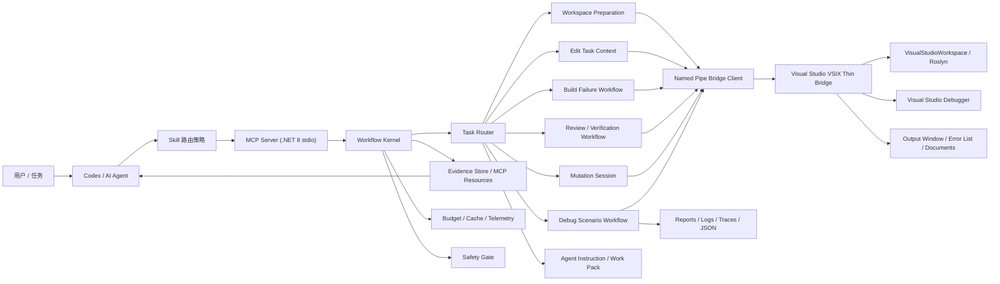
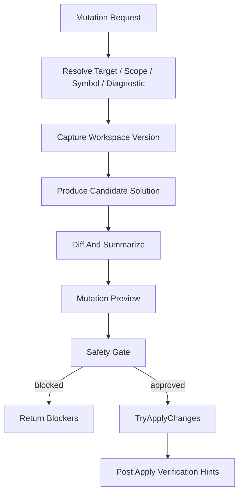

# Agentic C# Dev Workflow 架构

状态：v2 架构设计稿。  
日期：2026-06-12。  
适用范围：Visual Studio C# Dev Workflow 后续增强主线，目标是提升 AI Agent 在本地 C# / Visual Studio 开发中的速度、精准度、上下文效率和可控源码修改能力。

## 设计结论

下一阶段不应继续把工具做成“更多单点 MCP tools”。正确方向是把现有 Visual Studio、Roslyn、构建日志、调试器、产物证据和验证建议组织成 **Agentic C# Dev Workflow Hub**：AI 先进入任务级工作流入口，工具内部聚合证据、压缩上下文、给出下一步和安全阻断；只有在必要时才暴露底层 primitive 工具。

核心判断：

- 高频任务入口优先于工具数量：构建失败、编辑准备、调试异常、代码审查和验证计划应尽量一次拿到高信号上下文。
- Roslyn CodeAction 是下一阶段源码修改能力的关键；必须接入真正的 provider-backed preview/apply，而不是文本替换或 VS UI 自动化。
- MCP Resources / resource links 适合承载大上下文和可延迟读取证据，避免每次工具调用都把源码片段、日志和图结构塞进模型上下文。
- VSIX 应保持 thin bridge，所有耗时、缓存、预算、汇总和路由策略尽量放在外部 server / workflow kernel，避免拖慢 Visual Studio。
- Debug 能力应从“单步控制工具”升级为“调试场景编排”，但业务动作仍应通过 runner、启动参数、report、trace 或测试入口触发，不走 UI 点击。

## 目标

- 让 AI Agent 在 C# 任务开局时少走搜索、整文件读取和全量诊断。
- 把所有结果都做成可追溯证据包，区分事实、推断、启发式和假设。
- 对源码修改建立统一 preview/apply 会话，默认阻断风险，不允许静默修改。
- 让 Debug/Build/Review/Verification 可以按场景聚合，而不是由 AI 手工串联十几个工具。
- 为大 solution 提供默认预算、噪声过滤、缓存、性能计量和上下文预算控制。
- 让技能说明和工具 schema 共同驱动 AI 路由，减少 AI 误用底层工具。

## 非目标

- 不把 MCP 入口从工具优先改为 CLI 优先；CLI 只做批处理和基准补充。
- 不让外部 MCP server 直接访问 Visual Studio in-process API。
- 不通过 DTE 菜单、快捷键、Quick Actions UI 或 UI Automation 实现源码修改。
- 不把业务项目专属 runner/report schema 硬编码进通用工具。
- 不默认运行全量 build/test，不默认全 solution mutation。

## 总体架构



架构分层：

1. Skill 路由层：把用户意图映射到任务级入口，避免 AI 默认使用低层工具。
2. MCP Server 层：承载工具 schema、输入校验、目标路由、预算、缓存、证据资源和 workflow kernel。
3. Workflow Kernel 层：聚合多个能力域，生成证据包、下一步和安全阻断。
4. VSIX Thin Bridge 层：只负责访问 Visual Studio / Roslyn / Debugger / VS UI 上下文。
5. Evidence Store 层：保存可延迟读取的大证据，如源码片段、日志切片、诊断快照和影响图。
6. Mutation Session 层：所有源码写入必须先 preview，再 apply，并带版本校验和阻断模型。

## 能力面

### 1. 任务路由面

目标：AI 不从 83 个工具里猜，而是先选择任务级入口。

任务类型：

- `EditTask`：用户要求改代码、解释后修改、局部重构。
- `BuildFailure`：构建失败、测试编译失败、VS Error List 异常。
- `RuntimeDebug`：运行异常、断点、调用栈、变量、输出窗口。
- `ChangeReview`：审查已改代码、找风险、找测试缺口。
- `Verification`：决定跑哪些 build/test。
- `WorkspaceSetup`：VS 未打开、solution 未加载、VSIX 缺失。
- `Mutation`：rename、cleanup、CodeAction、Fix All、复杂重构。
- `AgentInstruction`：生成或更新 `AGENTS.md` / Copilot instructions / 项目工作流说明。

建议新增任务级工具：

- `prepare_csharp_edit_task`
- `investigate_csharp_runtime_exception`
- `prepare_csharp_change_review`
- `prepare_csharp_verification_run`
- `generate_csharp_agent_instructions`
- `split_csharp_agent_work`

这些工具应优先返回紧凑证据包，而不是直接返回所有底层原始结果。

### 2. 证据面

目标：所有结论都携带证据来源，AI 能判断可信度。

统一证据模型：

```text
EvidenceItem
  id
  kind: BuildLog | RoslynDiagnostic | Symbol | SourceSpan | DebugFrame | Artifact | VSDocument | Inference | Heuristic
  level: Fact | Inference | Heuristic | Assumption
  summary
  sourceRef
  relevanceReasons[]
  confidence
  isPartial
```

证据包模型：

```text
EvidencePacket
  taskId
  taskKind
  primaryFindings[]
  supportingEvidence[]
  resourceLinks[]
  recommendedNextActions[]
  safetyBlockers[]
  residualRisks[]
  budgets
  isPartial
```

证据等级约束：

- `Fact`：直接来自 build log、Roslyn、Visual Studio debugger、文件产物。
- `Inference`：由引用、调用图、项目图、派生关系推导。
- `Heuristic`：命名、路径、测试项目猜测。
- `Assumption`：缺少事实时显式声明的假设。

任何 workflow 结论不得把启发式包装成事实。

### 3. MCP Resources 面

目标：降低工具返回体积，把大上下文变成可按需读取资源。

当前 tools-only 模型的限制：

- 大日志、大源码片段、大影响图会直接占用模型上下文。
- 同一证据在多个工具之间重复返回。
- AI 无法延迟读取，只能一次性吞下工具输出。

建议资源类型：

- `csharp://task/{taskId}/context`
- `csharp://task/{taskId}/source/{documentId}`
- `csharp://task/{taskId}/build-log/{issueId}`
- `csharp://task/{taskId}/diagnostics`
- `csharp://task/{taskId}/impact-graph`
- `csharp://task/{taskId}/debug-evidence`
- `csharp://task/{taskId}/artifact/{artifactId}`

资源策略：

- 工具默认返回摘要和 resource link。
- resource 有 TTL，默认绑定当前 MCP server 会话。
- resource 内容必须可重新生成或标明不可重现。
- resource 读取也要有上限和 partial 标记。
- 资源不能成为新的事实源，只是事实的缓存视图。

### 4. 源码上下文面

目标：编辑前拿到“足够上下文”，避免整文件读取。

现有基础：

- `get_csharp_task_context`
- `get_csharp_symbol_source`
- `batch_get_csharp_symbol_sources`
- `get_csharp_source_context`
- `batch_get_csharp_source_contexts`
- `get_visual_studio_open_documents`
- `get_visual_studio_active_document_context`

v2 增强：

- `prepare_csharp_edit_task` 聚合用户需求、当前活动文档、changed files、相关符号、源码片段、影响面、测试建议。
- 对每个候选修改点返回 `EditCandidate`：
  - symbol
  - file/span
  - reason
  - requiredContextResource
  - risk
  - verificationHint
- 自动判断是否需要整文件读取，并说明原因。

输出约束：

- 默认只返回 top-N 候选修改点。
- 每个 snippet 必须标明是否截断。
- 如果代码生成或 partial class 影响上下文完整性，必须显式提示。

### 5. 构建失败工作流面

目标：从“日志排序工具”升级为“构建失败诊断会话”。

现有基础：

- `analyze_csharp_build_errors`
- `investigate_csharp_build_failure`
- `get_visual_studio_output_window`
- `get_visual_studio_error_list`
- `get_csharp_diagnostics`

v2 增强：

- `BuildFailureSession`
  - 输入：build output、build log path、VS Build pane、changed files、项目范围。
  - 输出：root cause candidates、cascade map、source context、related tests、recommended commands。
- 支持 build issue 到 enclosing symbol 的自动绑定。
- 支持 restore / target framework / source generator / analyzer / compiler / cascade 分类。
- 支持 known-noise profile 自动解释：哪些被过滤、哪些被降权。

关键规则：

- 显式 build log > 显式 build output > VS Build pane > Error List > Roslyn diagnostics。
- VS Build pane 必须标记可能 stale。
- 全 solution diagnostics 只能做背景，不覆盖 scoped evidence。

### 6. Mutation Session 面

目标：把源码修改从单工具调用升级为可审计会话。

现有基础：

- rename preview/apply
- cleanup preview/apply
- Code Fix / Fix All 安全入口
- complex refactoring plan-only
- Workspace Mutation Pipeline

v2 核心增强：真正接入 Roslyn CodeAction。

建议架构：



新增/升级能力：

- provider-backed `preview_csharp_code_fix`
- provider-backed `preview_csharp_fix_all`
- provider-backed `apply_csharp_code_fix`
- provider-backed `apply_csharp_fix_all`
- `preview_csharp_extract_method`
- `preview_csharp_change_signature`
- `preview_csharp_move_type`
- `create_csharp_mutation_session`
- `apply_csharp_mutation_session`

安全门：

- explicit target required for apply。
- workspace version mismatch blocked。
- preview truncation blocked。
- generated omissions blocked。
- unsupported document add/remove blocked。
- conflicts blocked。
- solution-wide mutation requires explicit allow。
- provider identity/title ambiguity blocked。

CodeAction 选择策略：

- 以 `diagnosticId + providerName + equivalenceKey + title + scope` 组成候选身份。
- preview 返回所有候选，但 apply 必须指定稳定候选身份。
- 如果候选集合变化，apply 失败并要求重新 preview。

### 7. Debug Scenario 面

目标：AI 不再手动一条条 step，而是按调试场景收集证据。

现有基础：

- Debug Context
- Debug Control
- `prepare_debug_session`

v2 增强工具：

- `configure_debug_scenario`
- `start_debugging_and_wait`
- `wait_for_breakpoint`
- `wait_for_exception`
- `wait_for_debug_output`
- `wait_for_artifact`
- `collect_debug_evidence`
- `cleanup_debug_session`

场景模型：

```text
DebugScenario
  target
  launchMode
  startupProject
  arguments
  environment
  breakpoints[]
  waitConditions[]
  artifactExpectations[]
  cleanupPolicy
```

边界：

- 不点击业务 UI。
- 表达式求值默认不允许副作用。
- 临时断点必须可清理。
- 等待类工具必须有 timeout、final state 和诊断。

### 8. Artifact Evidence 面

目标：把业务验证从“看窗口”转为“看结构化产物”。

现有基础：

- `collect_artifact_evidence`

v2 增强：

- `wait_for_artifact`
- `summarize_json_artifact`
- `summarize_trace_artifact`
- `correlate_artifact_with_debug_session`

证据类型：

- JSON report
- trace log
- plain log
- test result
- coverage result
- crash dump metadata

规则：

- 只读取用户指定目录或 workspace 内产物。
- 大文件只读摘要和匹配行。
- JSON 优先结构化解析，不用正则猜字段。
- 文件不存在、为空、格式错误必须作为诊断输出。

### 9. 性能与上下文预算面

目标：让工具能解释“慢在哪里”和“上下文花在哪里”。

采集指标：

- tool elapsed time
- VS bridge latency
- VS UI thread wait time
- Roslyn compilation/symbol finder time
- returned character count
- resource count
- cache hit/miss
- partial/truncation reason
- model-facing next-action count

建议工具：

- `get_csharp_workflow_performance_snapshot` 升级为按最近任务返回。
- `get_csharp_tool_telemetry`
- `benchmark_csharp_workflow_profile`
- `recommend_csharp_context_budget`

预算模型：

```text
WorkflowBudget
  maxToolCalls
  maxReturnedChars
  maxElapsedMilliseconds
  maxProjects
  maxDiagnostics
  maxReferences
  allowWholeSolution
```

默认策略：

- 先 scoped，再扩大。
- 先 context package，再 primitive tools。
- 先 resource link，再大文本。
- 先 changed files/project/symbol，再 whole solution。

### 10. Agent 指令与多 Agent 工作包

目标：让任何 AI Agent 更快进入本地 C# 项目。

建议工具：

- `generate_csharp_agent_instructions`
- `analyze_csharp_repo_workflow`
- `split_csharp_agent_work`
- `merge_csharp_agent_findings`

生成内容：

- solution 列表和主 solution 选择规则。
- build/test 命令。
- noisy paths。
- target framework / SDK 要求。
- 测试项目映射。
- 常见 runner/report/trace 入口。
- 专有术语和项目约束。
- 推荐使用 Visual Studio C# Dev Workflow 的路由规则。

多 Agent 工作包：

```text
AgentWorkPacket
  packetId
  objective
  scopeFiles[]
  scopeSymbols[]
  allowedTools[]
  evidenceResources[]
  budget
  expectedOutputSchema
```

主 Agent 负责拆包和合并；子 Agent 不应该全仓库扫描。

## 核心协议对象

建议新增通用 DTO：

- `AgentWorkflowRequest`
- `AgentWorkflowResult`
- `EvidencePacket`
- `EvidenceItem`
- `EvidenceResourceLink`
- `WorkflowBudget`
- `WorkflowNextAction`
- `SafetyBlocker`
- `MutationSession`
- `MutationCandidateIdentity`
- `DebugScenario`
- `AgentWorkPacket`

跨工具通用字段：

- `TaskId`
- `EvidenceLevel`
- `RelevanceReasons`
- `IsPartial`
- `PartialReasons`
- `ResourceLinks`
- `RecommendedNextActions`
- `SafetyBlockers`
- `Telemetry`

## 结构边界

### MCP Server

职责：

- task router
- workflow kernel
- evidence store
- resource read
- tool telemetry
- cache/budget
- DTO 转发
- 非 VS 依赖的文本/日志/产物解析

不做：

- 直接访问 Visual Studio SDK。
- 手写 C# 文件修改。
- 在多 VS 实例时猜副作用目标。

### VSIX

职责：

- Roslyn `VisualStudioWorkspace`
- provider-backed CodeAction / refactoring preview
- `TryApplyChanges`
- Debugger API
- Output Window / Error List / Documents
- bridge discovery / heartbeat

不做：

- 大型 workflow 编排。
- 长期证据存储。
- UI 自动化业务操作。

### Skill

职责：

- 任务路由默认策略。
- 什么时候用高层 workflow 工具。
- 什么时候允许低层工具。
- 安装/修复/VSIX mismatch 边界。
- 副作用工具授权提醒。

不做：

- 罗列所有工具后让 AI 自己猜。
- 鼓励全 solution diagnostics。
- 鼓励整文件读取作为默认。

## 实施阶段

### P0：任务级入口和证据模型

交付：

- `EvidencePacket` / `EvidenceItem` / `WorkflowBudget` / `WorkflowNextAction`。
- `prepare_csharp_edit_task`。
- `prepare_csharp_change_review`。
- `investigate_csharp_runtime_exception` 只读首版。
- skill 默认路由更新。

验收：

- 典型编辑任务开局工具调用数减少。
- 输出能明确区分事实、推断、启发式、假设。
- 大结果有 resource link 或 partial reason。

### P1：MCP Resources 和证据存储

交付：

- `resources/list` 返回当前会话 task resources。
- `resources/read` 读取 source/log/impact/debug evidence。
- workflow 工具返回 resource links。

验收：

- 大源码片段和日志不再默认塞满工具返回。
- resource 读取有 TTL、上限和 partial。

### P2：Roslyn CodeAction 接入

交付：

- provider-backed Code Fix preview/apply 已落地；apply 基于 MutationSessionStore replay 校验。
- provider-backed Fix All preview/apply 已落地；solution scope 必须显式允许，apply 基于 MutationSessionStore replay 校验。
- mutation session identity / workspace version 校验。

验收：

- apply 必须基于最新 preview。
- 候选变化、版本变化、冲突、截断、generated omission 均阻断。
- 不通过 VS UI 自动化。

### P3：Debug Scenario 和 Artifact Pipeline

交付：

- start/wait/collect/cleanup 调试场景。
- wait artifact。
- report/trace/log 结构化摘要。

验收：

- runner 场景能稳定产出 evidence packet。
- 不依赖点击窗口。

### P4：性能、Agent 指令和多 Agent 工作包

交付：

- 最近任务 telemetry。
- context budget recommendation。
- `generate_csharp_agent_instructions`。
- work packet split/merge。

验收：

- 能说明慢点来自工具轮次、Roslyn、VS bridge、输出体积还是模型决策。
- 生成的 Agent 指令能让新会话更快进入项目。

## 验收矩阵

| 能力 | 最低证据 | 验收方式 |
| --- | --- | --- |
| Edit task context | E3 | 本仓库真实 symbol edit 任务，少于 3 次上下文工具调用拿到候选修改点 |
| Build failure workflow | E3 | 噪声 solution 中主错误排名靠前，已知噪声被解释 |
| MCP Resources | E3 | 大日志只返回摘要和 link，按需读取切片 |
| CodeAction preview/apply | E3 | 文档级 code fix 可 preview/apply；apply 必须基于最新 preview，版本变化阻断 |
| Fix All | E3 | project 级 preview 可列 diff，solution 级需显式 allow |
| Debug scenario | E3 | 启动 runner、等待断点或 artifact、收集证据、清理 |
| Artifact pipeline | E3 | JSON/log/trace 缺失、格式错误、匹配行均可诊断 |
| Telemetry | E3 | 每个 workflow 可输出耗时、返回字符数、cache hit、partial |
| Agent instructions | E2 | 生成草稿并由人工审阅，不自动覆盖 |
| Multi-agent packets | E2 | 可生成包和合并格式，先不自动启动子 Agent |

## 风险与对策

- 风险：任务级工具过重，隐藏细节。
  - 对策：所有结论带 evidence/resource link，必要时可 drill down 到 primitive 工具。
- 风险：MCP resource 生命周期不清晰。
  - 对策：绑定 taskId 和 server session，TTL 明确，过期可重新生成。
- 风险：CodeAction provider 行为不稳定。
  - 对策：preview/apply 会话身份、workspace version、候选变化校验全部阻断。
- 风险：VSIX 负载过高。
  - 对策：VSIX thin bridge，耗时聚合、缓存和 budget 放 server；VSIX 查询可取消、可超时。
- 风险：AI 仍然默认用低层工具。
  - 对策：skill 路由改为任务入口优先，primitive 工具作为 fallback。
- 风险：多 Agent 扩大上下文浪费。
  - 对策：work packet 限定文件、符号、工具和预算，主 Agent 合并。

## 决策

- v2 主线名称：**Agentic C# Dev Workflow Hub**。
- 第一优先级不是新增小工具，而是 `prepare_csharp_edit_task`、`EvidencePacket`、MCP Resources 和 CodeAction mutation session。
- 所有后续源码修改能力必须继续走 preview/apply、安全阻断和显式 target。
- Skill 必须从“工具手册”升级为“任务路由策略”。
- 性能验收必须同时看工具调用轮次、返回字符数、耗时和 partial 质量。
