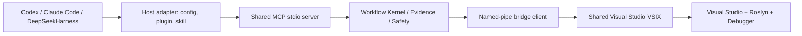

# GitHub 多宿主分发架构

状态：实施中。
日期：2026-08-17。
范围：将 Visual Studio C# Dev Workflow 作为可公开协作的 GitHub 工程发布，并在不复制核心实现的前提下支持 Codex、Claude Code 和 DeepSeekHarness。

## 目标与边界

目标：

- 让所有宿主复用同一组 MCP 工具、同一个 .NET server runtime 和同一个 VSIX bridge。
- 让 Codex 保持插件与 skill 的最佳体验，同时不要求 Claude Code 或 DeepSeekHarness 复刻 Codex 的插件模型。
- 将安装、配置、验证和发布过程写成可审计的仓库资产。

非目标：

- 不为每个宿主复制 MCP server、Roslyn 逻辑或 VSIX。
- 不以 DTE 或 UI 自动化模拟宿主功能。
- 不将供应商 API key、个人目录、Codex++ / cc-switch 数据库或本机 MCP 配置提交到 GitHub。
- 不宣称 DeepSeekHarness 已正式支持，直到真实版本上的端到端验证完成。

## 分层



不变量：

1. MCP server 是唯一对 AI 宿主公开的能力边界，server id 继续保持 `visual_studio_csharp_navigator`，避免破坏既有工具命名空间。
2. VSIX 是唯一访问 Visual Studio in-process API 的组件；任何宿主都不能绕过它直接调用 `VisualStudioWorkspace`。
3. 宿主适配层只包含配置、发现、使用说明和可选 skill，不包含业务逻辑。
4. 任务级 MCP 工具优先于低层 primitive 工具，保持速度、准确性与上下文预算策略一致。

## 宿主能力矩阵

| 能力 | Codex | Claude Code | DeepSeekHarness |
| --- | --- | --- | --- |
| MCP stdio server | 正式支持 | 配置适配已具备，待 E3 smoke | 实验性，待版本验证 |
| 任务级工作流指导 | Codex plugin skill | 仓库说明 / 项目指令 | 仓库说明 / 宿主提示词 |
| VSIX 安装 | 包内显式脚本 | 共用显式脚本 | 共用显式脚本 |
| 用户配置自动写入 | Codex installer | 不做，提供片段 | 不做，提供片段 |
| 真实端到端 smoke | 已完成 | 发布前应完成 | 发布前必须完成 |

Codex 是增强入口而不是核心依赖。Claude Code 和 DeepSeekHarness 没有与 Codex 等价的个人插件机制时，仍可通过标准 MCP 使用 82 个工具和 15 个资源模板。

## 配置契约

共享 MCP 配置的最小形态：

```json
{
  "mcpServers": {
    "visual_studio_csharp_navigator": {
      "command": "<absolute path to VisualStudio.CSharpNavigator.Server.exe>",
      "args": []
    }
  }
}
```

可选环境变量只控制 bridge 连接窗口，不包含机密：

- `VisualStudioBridge__ConnectTimeoutMilliseconds`
- `VisualStudioBridge__DiscoveryStaleAfterSeconds`

用户配置只可由用户或显式安装命令修改。仓库脚本默认生成独立片段，避免错误覆盖已有 MCP servers、模型供应商或其他客户端设置。

## 验证标准

每个宿主的发布验证至少包括：

1. 由宿主成功启动 server 并列出 schema。
2. Visual Studio 打开 `.sln` 与 `.slnx` 各一个样本，`prepare_csharp_workspace` 成功。
3. 执行 `get_csharp_workspace_status`、`search_csharp_symbols` 与一个 Compact 任务级入口。
4. 对涉及修改的工具只验证 preview；apply 必须使用独立测试 workspace。
5. 记录宿主版本、配置位置、server/VSIX 版本和失败诊断。

## 发布与安全

- GitHub Release 只分发可重复生成的 zip、VSIX 和哈希，不提交 runtime、staging 或个人缓存目录。
- `SECURITY.md` 处理安全报告；`CONTRIBUTING.md` 约束 issue、验证和敏感信息。
- 许可证尚未锁定。发布前由仓库所有者选择 MIT 或 Apache-2.0，并确认第三方依赖的许可证兼容性。
