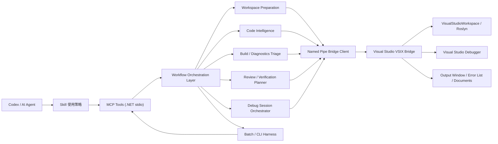

# Visual Studio C# Dev Workflow 下一代架构

状态：架构基线，阶段 B/C/I/J/K/L/M 已落地源码侧。  
日期：2026-06-05。  
范围：面向 AI 辅助 C# 开发的整体能力升级；当前文档同时记录已落地源码侧能力和后续工作边界。

> 2026-06-12 更新：后续增强主线升级为 **Agentic C# Dev Workflow Hub**，新的架构设计见 `docs/agentic-csharp-dev-workflow-architecture.md`。本文档保留为 v1 下一代架构和已落地能力追溯。

## 目标

下一代 **Visual Studio C# Dev Workflow** 的目标不是继续堆叠单点 MCP 工具，而是把 Visual Studio、Roslyn、构建日志、调试器、源码片段、验证建议和业务 runner 组合成一套 AI 能稳定使用的开发工作流。

核心目标：

- 让 AI 更快拿到高信号代码上下文，减少整文件读取、重复搜索和大输出。
- 让 AI 更精准定位构建失败、诊断噪声、调用链路、影响面和相关测试。
- 让 AI 能可靠控制 Visual Studio 调试会话，但不把 VS 当成脆弱的业务 UI 自动化器。
- 让复杂业务验证优先通过启动参数、runner、report 和 trace 完成，而不是点击窗口。
- 保持 Codex 插件 + MCP tools 为主入口，同时保留 CLI/batch harness 作为性能基准和固定流程补充。
- 将工具从“代码导航”升级为“C# 开发工作流操作系统”：准备环境、收集证据、压缩上下文、建议下一步、验证结果。

## 非目标

- 不把外部 MCP server 改成直接访问 Visual Studio SDK、EnvDTE 或 Roslyn `VisualStudioWorkspace`。这些能力仍只在 VSIX 进程内访问。
- 不用 DTE、调试表达式或 UI Automation 驱动业务界面点击、关闭窗口、菜单操作。
- 不把业务项目专属命令、CAD 文件格式或导入逻辑硬编码到通用工具。
- 不让工作流工具静默运行大范围 build/test、修改源码或改变 VS 状态。所有有副作用能力必须显式标注并要求目标实例。
- 不用 CLI 替代 Codex 日常 MCP 主入口。CLI 只作为补充入口。

## 资料依据

外部资料给出的约束：

- MCP stdio 传输是客户端启动本机 server 子进程，通过 stdin/stdout 交换 JSON-RPC 消息。它是本地进程通信，不是网络链路。参考：https://modelcontextprotocol.io/docs/concepts/transports
- MCP 架构强调 client/server 标准化工具和上下文交互，适合 Codex 发现工具 schema、参数和能力边界。参考：https://modelcontextprotocol.io/docs/concepts/architecture
- Visual Studio SDK 提供调试目标启动能力，例如 `IVsDebugger.LaunchDebugTargets`，适合调试会话控制。参考：https://learn.microsoft.com/en-us/dotnet/api/microsoft.visualstudio.shell.interop.ivsdebugger.launchdebugtargets?view=visualstudiosdk-2022
- Visual Studio 调试表达式求值发生在 break mode 下，可能触发副作用；本项目必须保持显式授权边界。参考：https://learn.microsoft.com/en-us/visualstudio/extensibility/debugger/expression-evaluation-in-break-mode?view=vs-2022
- Visual Studio Output Window 和 Running Document Table 是 IDE 侧上下文与文档状态的重要入口，适合作为证据源和定位辅助。参考：https://learn.microsoft.com/en-us/visualstudio/extensibility/visualstudio.extensibility/output-window/output-window?view=visualstudio 和 https://learn.microsoft.com/en-us/visualstudio/extensibility/internals/running-document-table?view=visualstudio

本地 dogfood 给出的约束：

- VS 启动调试、断点、调用栈、变量、Output Window、Error List 和 Roslyn 查询是稳定高价值路径。
- 通过 DTE/表达式求值模拟业务 UI 操作不稳定，容易受 native frame、焦点、窗口状态、COM 行为和脚本环境影响。
- 大型 solution 中全量 diagnostics、references、call graph 输出容易淹没当前任务，必须默认聚焦、排序、截断和解释。
- `.slnx` 已进入真实工作区范围，solution 发现、打开和验证不能只支持 `.sln`。

## 总体架构

下一代架构在现有双进程架构上增加两个逻辑层：工作流编排层和会话编排层。



架构不变量：

- MCP server 仍是外部 `.NET 8` stdio 进程。
- VSIX 仍是唯一访问 Visual Studio in-process API 的组件。
- 所有跨进程通信仍使用强类型协议 DTO。
- Workflow Orchestration Layer 只聚合、压缩、排序、建议，不直接成为事实源。
- Debug Session Orchestrator 可以改变调试状态，但必须保持显式 target、显式副作用和可清理状态。
- Batch / CLI Harness 复用同一套 server/bridge 能力，不复制业务逻辑。

## 能力域

### 1. Workspace Preparation

目标：让 AI 在用户没有打开 VS 或没有加载 solution 时，也能自动准备工作区。

能力：

- 发现当前仓库中的 `.sln` 和 `.slnx`。
- 多 solution 时按当前工作目录、最近修改、项目数量、用户上下文生成候选，不猜最终目标。
- 启动 Visual Studio 打开指定 solution。
- 等待 VSIX discovery 出现。
- 校验 VSIX bridge protocol、server version、插件入口和目标 solution。
- 返回可直接用于后续工具调用的 `targetInstanceId` / `targetPipeName`。

建议工具：

- `prepare_csharp_workspace`
- `find_csharp_solutions`
- `open_csharp_solution_in_visual_studio`
- `wait_for_visual_studio_bridge`

关键 DTO：

- `WorkspacePreparationRequest`
- `WorkspacePreparationResult`
- `SolutionCandidate`
- `BridgeReadinessState`

边界：

- 打开 VS 是有副作用动作，必须在工具元数据和 skill 中明确。
- 如果发现多个合理 solution，工具返回候选和原因，不自动选择。
- VSIX 安装或更新仍需用户授权，不静默执行。

### 2. Code Intelligence Context

目标：把“查代码”从零散 symbol 工具升级成紧凑上下文包，减少 AI 手工串联。

现有基础：

- symbol search、definitions、references、callers、callees、impact、inheritance、related tests。
- `get_csharp_symbol_source` 和 `get_csharp_source_context` 已能返回 Roslyn-backed bounded snippets。

增强方向：

- 批量获取多个符号的源码片段。
- 按构建错误 span、调用栈 frame、diagnostic span 自动拿源码上下文。
- 将 symbol、source snippet、references summary、impact summary 和 related tests 压成一个可编辑前上下文包。
- 支持 active/open document 上下文，让 AI 了解用户当前在 VS 看什么。

建议工具：

- `get_csharp_task_context`
- `batch_get_csharp_symbol_sources`
- `batch_get_csharp_source_contexts`
- `get_visual_studio_open_documents`
- `get_visual_studio_active_document_context`
- `open_csharp_source_location`

2026-06-26 源码落地状态：以上建议工具已在仓库源码中实现；后续 rename apply、cleanup、provider-backed Code Fix / Fix All preview/apply、复杂重构计划、Build Failure Context、Artifact Evidence / wait、Regression Scope、Debug Session Preparation、Debug Scenario、Performance Snapshot、Agentic 任务级入口、Agent 指令和多 Agent 工作包也已落地源码侧。Release server `tool-schema` 当前预期为 82 个 MCP tools，`resources/templates/list` 返回 15 个模板。当前不得自动更新 personal plugin runtime、VSIX、MCP 或 packaged skill，除非用户明确确认。

关键 DTO：

- `TaskContextPackage`
- `SourceSnippetSet`
- `OpenDocumentSnapshot`
- `ActiveDocumentContext`

边界：

- 源码片段工具只读，不替代 Codex 文件编辑流程。
- `open_csharp_source_location` 只是让 VS 导航到源码位置，不修改文件。
- 大结果必须包含 `isPartial`、截断原因和下一步建议。

### 3. Build And Diagnostics Triage

目标：让 AI 快速定位构建失败主因，而不是被全 solution diagnostics 或历史噪声淹没。

现有基础：

- `analyze_csharp_build_errors`
- `get_visual_studio_output_window`
- `get_visual_studio_error_list`
- diagnostics relevance ranking
- noise profile
- `start_csharp_investigation`

增强方向：

- 形成统一的 build failure context：构建日志、VS Build pane、Error List、scoped diagnostics、source context 和 next actions。
- 默认以显式 build output / build log 为最高事实源。
- VS Build pane 只作为 fallback，并标记 stale 风险。
- 将 build issue 自动关联到 enclosing symbol、project、changed files 和验证建议。

建议工具：

- `investigate_csharp_build_failure`
- `get_csharp_diagnostic_context`
- `rank_csharp_diagnostics_for_task`
- `summarize_visual_studio_build_state`

关键 DTO：

- `BuildFailureContext`
- `DiagnosticContext`
- `RootCauseCandidate`
- `CascadeDiagnostic`

边界：

- 不自动运行 build，除非新增单独显式有副作用工具并获得授权。
- 不把 Error List 当成唯一事实源；它是 IDE 侧辅助上下文。
- 全 solution diagnostics 默认只能作为背景扫描。

### 4. Review And Verification Planning

目标：让 AI 在改完代码后能自检影响面和最小验证集。

现有基础：

- `plan_csharp_verification`
- `review_csharp_change`
- related tests
- impact summary

增强方向：

- 基于 git changed files、build triage、symbol impact、project graph、related tests，生成 review packet。
- 明确区分强证据、启发式证据和假设。
- 给出最小可执行验证命令，但不自动执行。
- 对公共 API、接口成员、override、实现类、source generator、generated code、跨项目引用进行风险标注。

建议工具：

- `review_csharp_task_change`
- `plan_csharp_regression_scope`
- `summarize_csharp_public_api_impact`
- `find_csharp_test_gaps`

关键 DTO：

- `ChangeReviewPacket`
- `VerificationScopePlan`
- `PublicApiImpact`
- `TestGap`

边界：

- review 工具是只读审查助手，不替代人工 code review。
- 纯命名匹配 related tests 只能作为启发式，不生成高置信 single-test。
- 推荐命令必须标明置信度和原因。

### 5. Debug Session Orchestrator

目标：让 AI 能稳定调试复杂业务流程，少走 UI 自动化弯路。

现有基础：

- Debug Control：启动、继续、中断、停止、单步、断点管理。
- Debug Context：状态、调用栈、变量、表达式求值、线程、断点。

增强方向：

- 把一组调试动作合成会话编排，而不是让 AI 手动逐步调用。
- 支持等待断点、等待 Output Window 文本、等待进程退出、等待 report/trace 文件。
- 支持一次性收集证据包。
- 支持清理临时断点和临时启动配置。

建议工具：

- `prepare_debug_session`
- `configure_debug_launch`
- `start_debugging_and_wait`
- `wait_for_breakpoint`
- `wait_for_debug_output`
- `wait_for_artifact`
- `collect_debug_evidence`
- `stop_or_cleanup_debug_session`

关键 DTO：

- `DebugSessionPlan`
- `DebugLaunchConfiguration`
- `DebugWaitCondition`
- `DebugEvidencePackage`
- `DebugSessionCleanupPlan`

推荐业务模式：

```text
App.exe "D:\samples\case.ldwg"
  --run-case
  --source-path="D:\samples\case.ldwg"
  --report-path="D:\repo\.codex\case\report.json"
  --trace-path="D:\repo\.codex\case\trace.log"
```

边界：

- 不通过 DTE/表达式求值模拟点击、关窗、菜单命令。
- 表达式求值默认禁止副作用。
- 调试控制工具必须要求显式 target。
- 临时 launch 配置必须可诊断、可恢复。

### 6. Artifact And Evidence Pipeline

目标：把真实业务验证结果从“看日志”升级成“结构化证据”。

能力：

- 等待文件出现或更新。
- 读取 JSON report 并做结构化摘要。
- 读取 trace/log 尾部并按模式提取高信号行。
- 把 report/trace 与断点、输出窗口、源码上下文关联。
- 对文件不存在、格式错误、超时、空结果给出明确诊断。

建议工具：

- `wait_for_artifact`
- `read_json_artifact_summary`
- `read_log_artifact_tail`
- `correlate_debug_artifacts`

关键 DTO：

- `ArtifactWaitResult`
- `JsonArtifactSummary`
- `LogArtifactSummary`
- `EvidenceCorrelation`

边界：

- 通用工具只理解文件、JSON、日志和模式；不硬编码业务字段。
- 业务项目可以通过 report schema 约定输出更高质量证据。

### 7. Performance And Context Economy

#### 2026-07 Context-First Execution Upgrade

最近真实会话表明，主要瓶颈是重复 workspace 探测和重复返回任务大包，而不是本机 MCP stdio 协议。后续执行层按以下规则运行：

- 任务入口默认 `Compact` 响应，只返回决策所需的主证据、推荐动作、预算、遥测和 resource links；完整诊断、源码和报告通过 `csharp://task/...` 按需读取。
- `MaxReturnedChars` 是服务端硬预算。超过预算时必须标记 `ResponseBudgetExceeded`、保留最强证据并把详细内容留在 resource，而不能依赖客户端截断。
- 首次任务解析实际 bridge pipe 后签发十分钟 `WorkspaceContextLease`。后续任务传 lease，直接复用目标 pipe，避免重复列实例、solution 匹配和 health 探测；租约过期或 bridge/solution 变化时自动回退 discovery。
- 所有只读热点缓存必须使用 workspace target/fingerprint/scope 作为键，并通过 single-flight 合并并发相同请求；至少覆盖 workspace 准备、health、workspace status、source context、scoped diagnostics、symbol search 和 project graph。
- 遥测记录实际序列化字符数、cache hit、bridge/Roslyn/UI 等待分段、重试和 partial 原因；优化以真实会话样本的 p50/p95 与 token 字符数为准。

目标：优化 AI 速度、token、上下文和工具轮次。

原则：

- 优先减少工具轮次，而不是优先换协议。
- 优先输出 top-N 和 source snippets，而不是全量列表。
- 所有大输出必须带截断诊断和下一步扩大建议。
- 短时缓存只能缓存可重复、只读、强类型结果，并暴露 cache hit diagnostics。

增强方向：

- 批量源码上下文工具。
- 批量 symbol references/callees summary。
- workspace status / project graph / symbol search 更广泛短时缓存。
- large benchmark 记录 wall time、输出字符数、工具轮次、partial 状态。
- MCP vs CLI 对照基准。

建议工具：

- `batch_csharp_context`
- `batch_csharp_symbol_summary`
- `measure_csharp_workflow_performance`

关键指标：

- wall time
- MCP tool call count
- named pipe request count
- output characters
- partial count
- cache hit count
- top evidence hit rate

### 8. CLI / Batch Harness

目标：为固定流程、CI 和性能基准提供低交互入口。

定位：

- MCP 是 Codex 日常主入口。
- CLI 是脚本化补充，不复制业务逻辑。
- CLI 输出必须是结构化 JSON 或 compact line protocol。

适合 CLI 的场景：

- benchmark。
- smoke test。
- 一次性收集 workspace status + symbol context + diagnostics。
- CI 中验证 tool schema、VSIX hash、runtime hash、distribution 包完整性。

不适合 CLI 的场景：

- 需要 AI 根据中间证据动态选择下一步。
- 需要用户授权或多实例目标选择的交互任务。
- 需要保留 MCP 工具只读/副作用元数据的任务。

建议入口：

- `VisualStudio.CSharpNavigator.Cli`
- 或在现有 E2E/benchmark harness 上扩展 `workflow` profile。

## 工具分层

下一代工具应分为四层，避免能力命名混乱。

### Primitive Tools

单一事实查询或单一控制动作。

示例：

- `search_csharp_symbols`
- `find_csharp_references`
- `get_debug_call_stack`
- `set_debug_breakpoint`

要求：

- 强类型输入输出。
- 小而稳定。
- 可组合。

### Context Tools

围绕一个文件、符号、诊断或 frame 生成紧凑上下文。

示例：

- `get_csharp_symbol_source`
- `get_csharp_source_context`
- `get_csharp_diagnostic_context`
- `get_debug_frame_source_context`

要求：

- 默认小输出。
- 包含 source span 和 reason。
- 有 partial 诊断。

### Workflow Tools

为一个开发任务生成证据包和下一步建议。

示例：

- `start_csharp_investigation`
- `investigate_csharp_build_failure`
- `review_csharp_task_change`
- `plan_csharp_verification`

要求：

- 默认只读。
- 明确事实、推断、启发式、假设。
- 输出 `RecommendedNextActions`。

### Orchestration Tools

有副作用的调试会话或工作区准备编排。

示例：

- `prepare_csharp_workspace`
- `start_debugging_and_wait`
- `wait_for_artifact`
- `stop_or_cleanup_debug_session`

要求：

- 显式 target。
- 显式副作用元数据。
- 可超时、可取消、可清理。
- 输出足够诊断，不能空成功。

## 协议模型原则

所有新增 DTO 遵守以下原则：

- 字段表达事实，不用自由文本承载核心语义。
- 每个结果都有 `Diagnostics` 和 `IsPartial` 或等价字段。
- 每个聚合结果必须能追溯到 source span、project、document、debug frame、artifact path 或 output pane。
- `Reason` 字段必须区分：
  - `Fact`：直接来自 build log、Roslyn、VS debugger、artifact。
  - `Inference`：由项目图、引用关系、调用图推导。
  - `Heuristic`：命名、路径、测试项目猜测。
  - `Assumption`：缺少事实时的显式假设。
- 有副作用请求必须包含 target 和 timeout。
- 等待类工具必须返回最终状态：`Completed`、`TimedOut`、`Canceled`、`Failed`。
- 结构化输出必须稳定，方便 Codex 和后续 CLI 共同消费。

## Skill 使用策略升级

packaged skill 应从“知道有哪些工具”升级为“按任务路由”。

默认 C# 本地任务流程：

1. 检查当前仓库是否有 `.sln` / `.slnx`。
2. 如果无 active bridge，调用 workspace preparation 流程打开 VS 并等待 discovery。
3. 调用 health/workspace status，确认 VSIX 和 server 版本。
4. 根据任务类型选择入口：
   - 构建失败：`investigate_csharp_build_failure`
   - 代码解释/编辑：`get_csharp_task_context`
   - 改动审查：`review_csharp_task_change`
   - 验证计划：`plan_csharp_verification`
   - 调试失败：`collect_debug_evidence` 或 debug session orchestrator
5. 只在证据不足时扩大 scope。
6. 编辑后先跑 verification planner，再执行最小建议命令。

skill 需要明确：

- 优先使用源码上下文工具，而不是直接整文件读取。
- 多实例必须显式选择 target。
- VSIX 缺失或版本不匹配时先诊断并请求授权。
- Debug Control 和 workspace opening 是有副作用动作。
- UI 自动化不是推荐路径，业务验证应使用 runner/report/trace。

## 实施路线

### 阶段 A：架构收口和协议准备

交付：

- 本文档落地。
- 更新 `docs/implementation-plan.md` 顶部 Todo。
- 梳理现有 DTO，可复用字段、命名和 partial 传播规则。

验收：

- 文档明确目标、非目标、工具分层和风险边界。
- 不需要运行代码。

### 阶段 B：Workspace Preparation

交付：

- `.sln` / `.slnx` 发现。
- 打开 VS solution。
- 等待 bridge。
- health 检查集成。

验收：

- 未开 VS 时，AI 能从仓库自动打开唯一 solution 并拿到 target。
- 多 solution 时返回候选，不猜。
- `.slnx` 进入 E2E。

### 阶段 C：Code Context Batch

交付：

- 批量 symbol source。
- 批量 source context。
- task context package。
- active/open document context。

验收：

- 典型编辑任务不需要整文件读取即可拿到足够上下文。
- 输出字符数和工具轮次低于当前手工流程。

### 阶段 D：Build Failure Context

交付：

- 构建失败上下文包。
- build issue 到 symbol/source/project/test 的关联。
- Output Window / Error List / scoped diagnostics 合流。

验收：

- 噪声 solution 中 top issue 不被已知无关目录淹没。
- 对 restore、TFM、generated output、compiler、cascade 分类稳定。

### 阶段 E：Debug Session Orchestrator

交付：

- prepare/configure/start/wait/collect/cleanup 调试会话工具。
- 等待断点、输出文本、artifact。
- Debug evidence package。

验收：

- 业务 runner 场景能稳定完成：启动 -> 命中断点或产物 -> 收集证据 -> 清理。
- 不依赖 UI 点击或表达式副作用。

### 阶段 F：Artifact Evidence Pipeline

交付：

- JSON report 摘要。
- trace/log tail 摘要。
- artifact 与 debug/build/source evidence 关联。

验收：

- report/trace 缺失、空结果、格式错误都可诊断。
- AI 能用结构化产物判断业务流程是否真的执行。

### 阶段 G：Review And Verification Upgrade

交付：

- review packet 升级。
- regression scope planner。
- public API impact summary。
- test gap finder。

验收：

- 改动后 AI 能给出高信号风险、缺测试风险和最小验证命令。
- 启发式测试不冒充强证据。

### 阶段 H：Performance And CLI Harness

交付：

- MCP vs CLI 对照基准。
- workflow benchmark profile。
- 可选 CLI/batch JSON 输出。
- 结果记录到 benchmark 文档。

验收：

- 能回答“慢在哪里”：模型轮次、MCP 调度、named pipe、Roslyn、VS UI thread、输出体积。
- CLI 只在固定批处理显著收益时作为补充保留。

## 验证矩阵

| 场景 | 目标证据等级 | 必测项 |
| --- | --- | --- |
| 本仓库 solution | E3 | workspace prep、source context、build failure context、review packet |
| `.slnx` sample | E3 | solution discovery、workspace status、symbol search |
| 大型噪声 solution | E3 | diagnostics ranking、build triage、workflow 输出压缩 |
| Debug control sample | E3 | start/wait/breakpoint/evidence/cleanup |
| 真实业务 runner | E3 | launch args、report、trace、breakpoint、artifact summary |
| Benchmark profile | E4 | wall time、输出体积、工具轮次、cache hit |
| Distribution smoke | E3 | plugin runtime、VSIX、skill、tool schema |

## 风险与对策

- 风险：新增工具过多，AI 更难选择。
  - 对策：按 Primitive / Context / Workflow / Orchestration 分层，skill 默认只暴露任务入口流程。
- 风险：Orchestration 工具副作用太大。
  - 对策：显式 target、timeout、dry-run/preflight、cleanup plan、诊断输出。
- 风险：CLI 与 MCP 逻辑分叉。
  - 对策：CLI 只调用同一服务层或 MCP stdio，不复制业务逻辑。
- 风险：工作流输出变大。
  - 对策：top-N、partial、snippet、summary、可扩 scope。
- 风险：业务 runner 缺少 report/trace。
  - 对策：通用工具只提供 artifact pipeline；业务项目逐步补 report schema。
- 风险：VSIX version mismatch 导致行为不一致。
  - 对策：workspace preparation 和 health 强制暴露版本状态。
- 风险：多 VS 实例误控。
  - 对策：所有副作用工具要求显式 target。

## 决策

当前建议锁定以下主干方向：

- Codex 日常入口继续使用 MCP。
- CLI/batch 作为性能和固定流程补充。
- 先做高层上下文包和调试会话编排，少做孤立小工具。
- 业务自动化走 runner/report/trace，不走 UI 点击。
- VSIX 继续作为唯一 VS/Roslyn/Debugger in-process 访问层。
- 所有新能力必须以“更快、更准、更少 token、更少工具轮次”为验收指标。

## 开放问题

- 是否需要在插件中提供统一命令行 `VisualStudio.CSharpNavigator.Cli.exe`，还是继续扩展现有 E2E/benchmark harness。
- Debug launch 配置应优先改 `.json`、调用 VS SDK 启动参数，还是只支持当前 startup project 的临时参数覆盖。
- Artifact JSON summary 是否需要支持 JSONPath 风格字段选择。
- Open documents / active document 工具是否需要有副作用地激活 VS 窗口，还是只读返回状态。
- 是否需要为业务项目提供 report/trace schema 建议模板。
